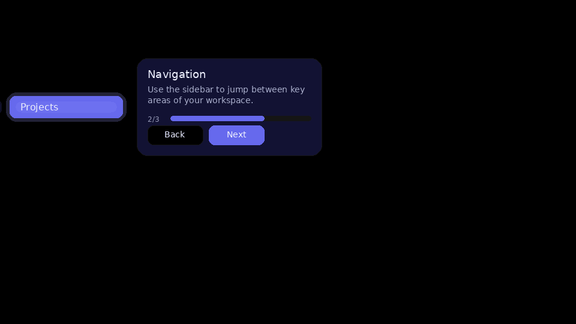
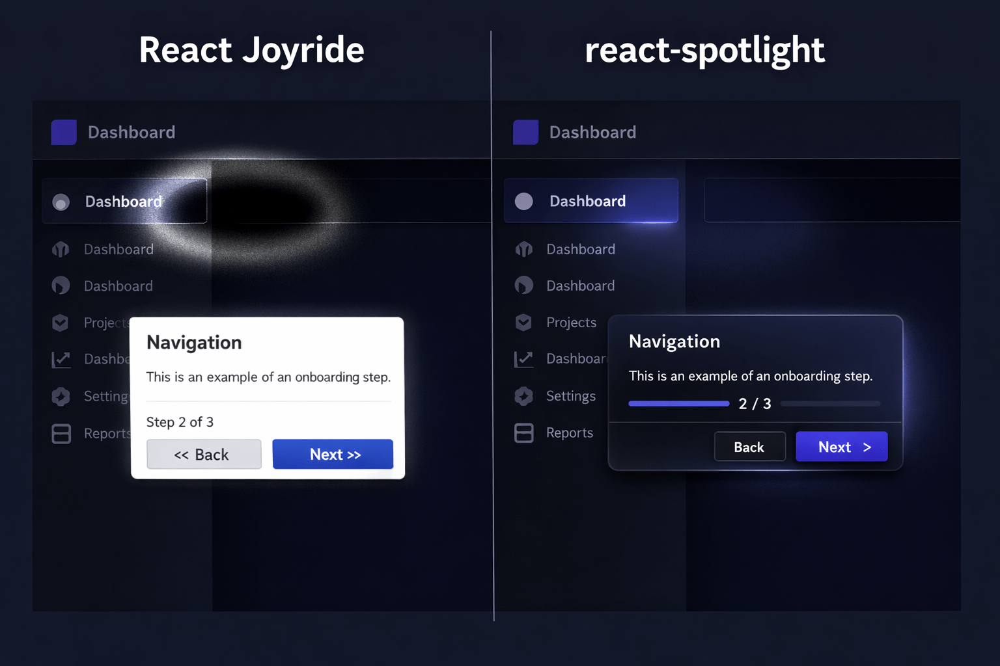

<p align="center">
  
</p>

<h1 align="center">react-spotlight</h1>

<p align="center">
  Beautiful onboarding tours & feature highlights for React.<br/>
  Zero dependencies. Looks like 2026, not 2018.
</p>

<p align="center">
  <a href="https://www.npmjs.com/package/react-spotlight"></a>
  <a href="https://bundlephobia.com/package/react-spotlight"></a>
  <a href="https://github.com/bilaltahir/react-spotlight/blob/main/LICENSE"></a>
  <a href="https://www.npmjs.com/package/react-spotlight"></a>
</p>

---

## The Problem

<p align="center">
  
</p>

React Joyride — the most popular tour library — is **broken on React 19**. It uses deprecated APIs (`unmountComponentAtNode`, `unstable_renderSubtreeIntoContainer`) and hasn't been updated in 9+ months. Shepherd.js requires a paid commercial license. Intro.js is GPL. Driver.js has no React bindings. Every developer evaluating tour libraries in 2025–2026 hit the same wall: **nothing modern, free, and React-native exists.**

react-spotlight fills that gap.

## Install

```bash
npm install react-spotlight @floating-ui/react-dom
```

## Quickstart

```tsx
import { SpotlightProvider, SpotlightTour, useSpotlight } from 'react-spotlight'
import 'react-spotlight/styles.css'

function App() {
  return (
    <SpotlightProvider>
      <SpotlightTour
        id="onboarding"
        steps={[
          {
            target: '#search-input',
            title: 'Search',
            content: 'Find anything instantly with our search.',
            placement: 'bottom',
          },
          {
            target: '[data-tour="sidebar"]',
            title: 'Navigation',
            content: 'Browse your projects and teams here.',
            placement: 'right',
          },
        ]}
      />
      <Dashboard />
    </SpotlightProvider>
  )
}

function Dashboard() {
  const { start } = useSpotlight()
  return <button onClick={() => start('onboarding')}>Start Tour</button>
}
```

## Why react-spotlight

|  | What you get |
|---|---|
| **Beautiful by default** | Modern, polished tooltips with smooth CSS clip-path spotlight transitions. Light, dark, and custom themes out of the box. |
| **Accessible** | WCAG 2.1 AA compliant. Focus trap, keyboard navigation, ARIA roles, screen reader announcements. |
| **Tiny** | ~5KB gzipped core (vs ~30KB for Joyride). Floating UI is an optional peer dependency. |
| **MIT License** | Free for commercial use. No GPL restrictions, no paid tiers. |

## Features

- **CSS clip-path spotlight** — GPU-accelerated, perfect in dark mode (no `mix-blend-mode` hacks)
- **Floating UI positioning** — smart flip, shift, and overflow handling
- **Full keyboard navigation** — Arrow keys, Escape, Tab focus trap
- **Async element waiting** — `MutationObserver`-based, handles lazy-loaded content
- **Light / Dark / Custom themes** — auto-detect OS preference or bring your own
- **Responsive & mobile-friendly** — works on any screen size
- **React 19 compatible** — built for modern React, no deprecated APIs
- **i18n support** — customize all button labels and step text
- **Single-element highlights** — one-off "What's new" callouts without a full tour
- **Custom tooltips** — full render prop API for complete control

## Comparison

| Feature | react-spotlight | React Joyride | Shepherd.js | Driver.js | Intro.js |
|---|---|---|---|---|---|
| **React 19** | Yes | Broken | Wrapper | No React | No React |
| **License** | MIT | MIT | Paid commercial | MIT | GPL / Paid |
| **Bundle size** | ~5KB | ~30KB | ~25KB | ~5KB | ~12KB |
| **React-first** | Yes | Yes | No (vanilla JS) | No (vanilla JS) | No (vanilla JS) |
| **Dark mode** | clip-path | mix-blend breaks | SVG | Yes | Partial |
| **Accessibility** | WCAG 2.1 AA | Limited | Limited | Limited | Poor |
| **Focus trap** | Yes | No | No | No | No |
| **Zero deps** | Yes | No | No | Yes | No |

## Documentation

Visit **[react-spotlight.dev](https://react-spotlight.dev)** for the full docs — API reference, interactive examples, theming guide, accessibility details, and recipes for Next.js, Remix, and shadcn/ui.

## Contributing

We welcome contributions! See [CONTRIBUTING.md](CONTRIBUTING.md) for development setup, project structure, and PR workflow.

## License

[MIT](LICENSE)
