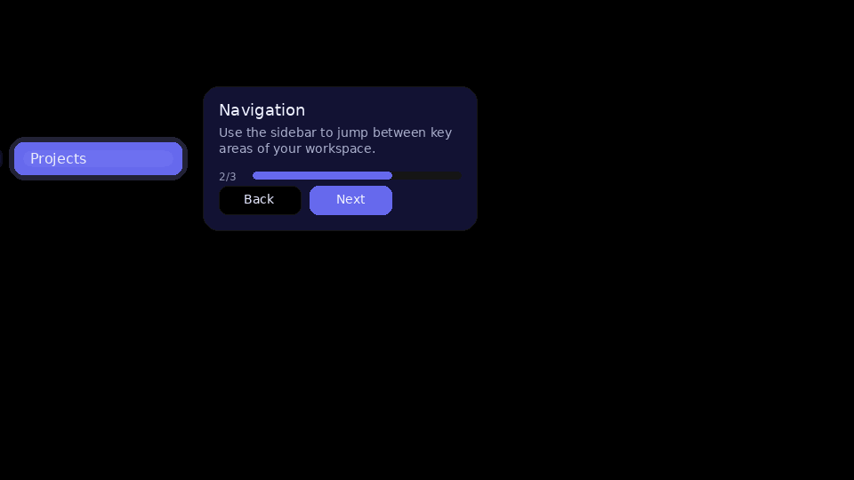
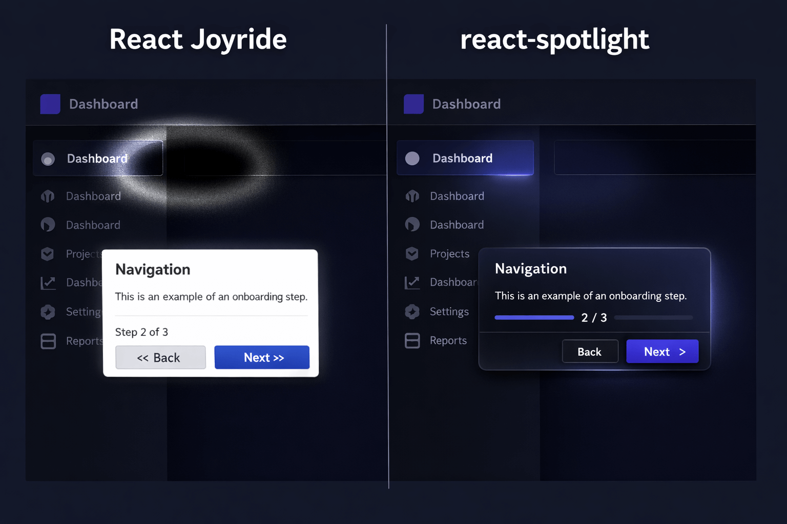

<p align="center">
  
</p>

<h1 align="center">react-tourlight</h1>

<p align="center">
  Beautiful onboarding tours & feature highlights for React.<br/>
  One small peer dependency (Floating UI). Looks like 2026, not 2018.
</p>

<p align="center">
  <a href="https://www.npmjs.com/package/react-tourlight"></a>
  <a href="https://bundlephobia.com/package/react-tourlight"></a>
  <a href="https://github.com/btahir/react-tourlight/blob/main/LICENSE"></a>
  <a href="https://www.npmjs.com/package/react-tourlight"></a>
</p>

<p align="center">
  <a href="assets/launch-video.mp4">Watch the launch video</a>
</p>

---

<p align="center">
  
</p>

## The Problem

<p align="center">
  
</p>

React Joyride — the most popular tour library — is **broken on React 19**. It uses deprecated APIs (`unmountComponentAtNode`, `unstable_renderSubtreeIntoContainer`) and hasn't been updated in 9+ months. Shepherd.js requires a paid commercial license. Intro.js is GPL. Driver.js has no React bindings. Every developer evaluating tour libraries in 2025–2026 hit the same wall: **nothing modern, free, and React-native exists.**

react-tourlight fills that gap.

## Install

```bash
npm install react-tourlight @floating-ui/react-dom
```

`@floating-ui/react-dom` is a **required peer dependency** — it powers tooltip
positioning (flip, shift, overflow handling). It's a peer dep rather than a
bundled dependency so you control the version and it isn't duplicated if
something else in your app already depends on it.

```bash
# yarn
yarn add react-tourlight @floating-ui/react-dom

# pnpm
pnpm add react-tourlight @floating-ui/react-dom
```

**Next.js App Router:** as of v0.2.0 the package ships its own `"use client"`
directive, so `SpotlightProvider`, `SpotlightTour`, and friends can be
imported directly into a Server Component (like `app/layout.tsx`) without
wrapping them in your own client component first — Next.js honors the
boundary declared inside `react-tourlight` itself.

## Quickstart

```tsx
import { SpotlightProvider, SpotlightTour, useSpotlight } from 'react-tourlight'
import 'react-tourlight/styles.css'

function App() {
  return (
    <SpotlightProvider>
      <SpotlightTour
        id="onboarding"
        steps={[
          {
            target: '#search-input',
            title: 'Search',
            content: 'Find anything instantly with our search.',
            placement: 'bottom',
          },
          {
            target: '[data-tour="sidebar"]',
            title: 'Navigation',
            content: 'Browse your projects and teams here.',
            placement: 'right',
          },
        ]}
      />
      <Dashboard />
    </SpotlightProvider>
  )
}

function Dashboard() {
  const { start } = useSpotlight()
  return <button onClick={() => start('onboarding')}>Start Tour</button>
}
```

## Why react-tourlight

|  | What you get |
|---|---|
| **Beautiful by default** | Modern, polished tooltips with smooth CSS clip-path spotlight transitions. Light, dark, and custom themes out of the box. |
| **Accessible** | WCAG 2.1 AA compliant. Focus trap, keyboard navigation, ARIA roles, screen reader announcements. |
| **Tiny** | ~5KB gzipped core (vs ~30KB for Joyride). Floating UI is a required peer dependency for positioning. |
| **MIT License** | Free for commercial use. No GPL restrictions, no paid tiers. |

## Features

- **CSS clip-path spotlight** — GPU-accelerated, perfect in dark mode (no `mix-blend-mode` hacks)
- **Floating UI positioning** — smart flip, shift, and overflow handling
- **Full keyboard navigation** — Arrow keys, Escape, Tab focus trap that opens with focus on the primary (Next/Done) button
- **Async element waiting** — `MutationObserver`-based, handles lazy-loaded content, with a configurable timeout (`SpotlightStep.timeout` / `SpotlightProviderProps.waitForElementTimeout`) and a dimmed loading overlay while a target is still resolving
- **Light / Dark / Custom themes** — auto-detect OS preference (and stay in sync when it changes live), or bring your own theme, including working hover states on buttons and the close button
- **Responsive & mobile-friendly** — works on any screen size
- **React 19 compatible** — built for modern React, no deprecated APIs
- **Next.js / RSC ready** — ships its own `"use client"` directive, no manual wrapper required
- **i18n support** — customize all button labels and step text
- **Multi-page / route-aware tours** — a tour can pause on one route, navigate to another (SPA _or_ full page reload), and resume automatically via pluggable persistence (`localStorage` / custom / memory). Router-agnostic — plug in `next/navigation`, React Router, or `location.assign` (see below)
- **Single-element highlights** — one-off "What's new" callouts without a full tour
- **Custom tooltips** — full render prop API for complete control, with unique per-instance ARIA ids (`useId`) so multiple tooltips never collide and no `aria-labelledby`/`aria-describedby` reference is left dangling
- **True interactive targets** — `interactive: true` makes the spotlight hole genuinely transparent to _all_ pointer/keyboard/focus events (typing, hovering, dragging, scrolling) — real event pass-through, not synthesized clicks. Add `advanceOn` to auto-advance when the user clicks the real button/link
- **Headless core** — the entire unstyled engine (state machine, element resolution, clip-path, focus/a11y, and a `useTour` hook) is available from `react-tourlight/core` with **no CSS and no Floating UI**, for fully custom tour UIs (see below)

## Multi-page tours

A tour can span multiple routes and survive both SPA navigation and full page
reloads. Enable persistence and give the provider a `navigate` callback wired
to your router, then tag steps with the `route` they live on:

```tsx
'use client'

import { useRouter } from 'next/navigation'
import { SpotlightProvider, SpotlightTour } from 'react-tourlight'
import 'react-tourlight/styles.css'

function Providers({ children }: { children: React.ReactNode }) {
  const router = useRouter()
  return (
    <SpotlightProvider
      persist          // localStorage by default; pass a custom storage object if you like
      navigate={(path) => router.push(path)}
    >
      <SpotlightTour
        id="onboarding"
        steps={[
          { target: '#dashboard-header', title: 'Dashboard', content: 'Your home base.', route: '/dashboard' },
          // Advancing to this step navigates to /settings, then waits for the target there:
          { target: '#profile-section', title: 'Profile', content: 'Update your details.', route: '/settings' },
        ]}
      />
      {children}
    </SpotlightProvider>
  )
}
```

How it works:

- **`route`** — when advancing to a step whose `route` doesn't match
  `window.location.pathname`, the provider calls `navigate(route)` and then
  waits (via the built-in `MutationObserver`) for the target on the new page.
- **`persist`** — `true` uses `localStorage`; pass a `SpotlightStorage` object
  (e.g. `createMemoryStorage()` or `window.sessionStorage`) for other backends.
  Tour state is saved on every change.
- **`resume`** (default `true`) — on mount, a persisted, still-active tour is
  automatically resumed at the exact step it left off, so a **full page
  reload** picks the tour right back up. Stale snapshots (older than
  `persistMaxAge`, or from a tour whose step count changed) are ignored.
- **Router-agnostic** — route matching compares against
  `window.location.pathname` (exact, `:param`, or trailing `*`). Override it
  with `isRouteActive={(route, pathname) => ...}` for anything custom. Works
  with Next.js, React Router, TanStack Router, or `location.assign`.

## Interactive steps

Set `interactive: true` and the spotlight hole becomes a genuine gap in the
overlay — real clicks, typing, hovering, dragging, and scrolling all reach the
highlighted element (no synthesized events). Add `advanceOn` to advance the
tour when the user actually interacts with the target:

```tsx
<SpotlightTour
  id="create-flow"
  steps={[
    {
      target: '#new-project-btn',
      title: 'Create a project',
      content: 'Click the button to continue.',
      interactive: true,
      // Auto-advance when the real button is clicked:
      advanceOn: { event: 'click' },
    },
    {
      target: '#project-name',
      title: 'Name it',
      content: 'Type a name, then press Enter.',
      interactive: true,
      advanceOn: { event: 'keydown', selector: 'input' },
    },
  ]}
/>
```

`advanceOn` composes with `route` steps — clicking a real link that navigates
advances the tour, and the next step resumes on the destination page.

## Headless core (`react-tourlight/core`)

Most consumers only need `SpotlightProvider`, `SpotlightTour`, and
`useSpotlight`. If you want to render your **own** overlay and tooltip, import
the unstyled engine from `react-tourlight/core` — it ships **no CSS, no default
tooltip, and no Floating UI** in its graph:

```tsx
import { useTour, type SpotlightStep } from 'react-tourlight/core'
// no 'react-tourlight/styles.css' needed

function CustomTour({ steps }: { steps: SpotlightStep[] }) {
  const tour = useTour({ steps })

  if (!tour.isActive || !tour.rect) {
    return <button onClick={tour.start}>Start</button>
  }

  return (
    <>
      {/* Your own overlay — clipPath is generated for you */}
      <div
        style={{
          position: 'fixed',
          inset: 0,
          background: 'rgba(0,0,0,0.5)',
          clipPath: tour.clipPath,
          pointerEvents: 'none',
        }}
      />
      {/* Your own tooltip, positioned however you like */}
      <div style={{ position: 'fixed', top: tour.rect.y + tour.rect.height + 8, left: tour.rect.x }}>
        <h3>{tour.step?.title}</h3>
        <div>{tour.step?.content}</div>
        <button onClick={tour.previous}>Back</button>
        <button onClick={tour.next}>
          {tour.currentIndex + 1 === tour.totalSteps ? 'Done' : 'Next'}
        </button>
      </div>
    </>
  )
}
```

`useTour` drives the state machine, resolves and measures each step's target
(async waiting, scrolling, and route-aware `navigate` included), and hands you
`clipPath`, `rect`, `targetElement`, and the current `step`. The lower-level
building blocks are also exported for even more control:

```tsx
import {
  createTourStateMachine, // drives step/lifecycle state without any UI
  waitForElement,         // MutationObserver-based "wait for selector" helper
  resolveTarget,          // resolve a CSS selector or ref to an HTMLElement
  getTargetRect,          // getBoundingClientRect() as a plain ElementRect
  measureElement,         // getBoundingClientRect() + padding
  generateClipPath,       // build the CSS clip-path for a spotlight cutout
  isRouteActive,          // router-agnostic path matcher
  createMemoryStorage,    // in-memory SpotlightStorage adapter
  createFocusTrap,        // trap Tab focus inside a container
  setInert,               // mark the rest of the page inert
} from 'react-tourlight/core'
```

These are the same primitives `SpotlightProvider` uses internally. (For
convenience, the engine primitives and `useTour` are also re-exported from the
main `react-tourlight` entry, but importing from `/core` keeps Floating UI and
the default styles out of your bundle.)

## Comparison

| Feature | react-tourlight | React Joyride | Shepherd.js | Driver.js | Intro.js |
|---|---|---|---|---|---|
| **React 19** | Yes | Broken | Wrapper | No React | No React |
| **License** | MIT | MIT | Paid commercial | MIT | GPL / Paid |
| **Bundle size** | ~5KB | ~30KB | ~25KB | ~5KB | ~12KB |
| **React-first** | Yes | Yes | No (vanilla JS) | No (vanilla JS) | No (vanilla JS) |
| **Dark mode** | clip-path | mix-blend breaks | SVG | Yes | Partial |
| **Accessibility** | WCAG 2.1 AA | Limited | Limited | Limited | Poor |
| **Focus trap** | Yes | No | No | No | No |
| **Multi-page tours** | Built-in (persist + resume) | No | Manual | No | No |
| **Headless core** | Yes (`/core`, no CSS/Floating UI) | No | Partial | No | No |
| **Zero deps** | No (1 peer: Floating UI) | No | No | Yes | No |

## Documentation

Visit **[react-tourlight.vercel.app](https://react-tourlight.vercel.app)** for the full docs — API reference, interactive examples, theming guide, accessibility details, and recipes for Next.js, Remix, and shadcn/ui.

## Contributing

We welcome contributions! See [CONTRIBUTING.md](CONTRIBUTING.md) for development setup, project structure, and PR workflow.

## License

[MIT](LICENSE)
